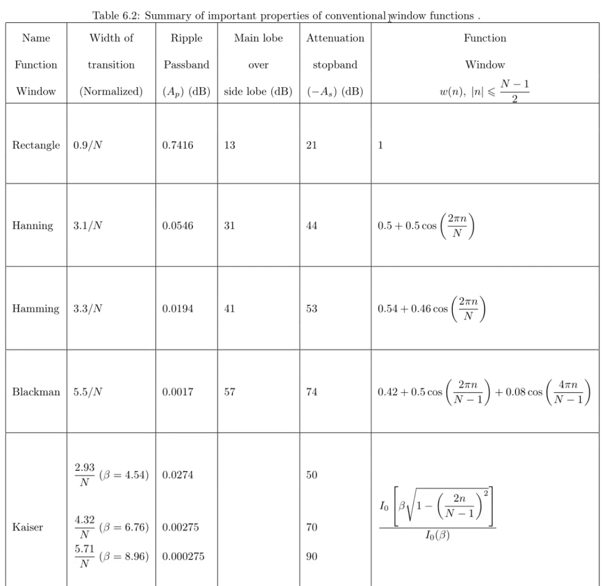
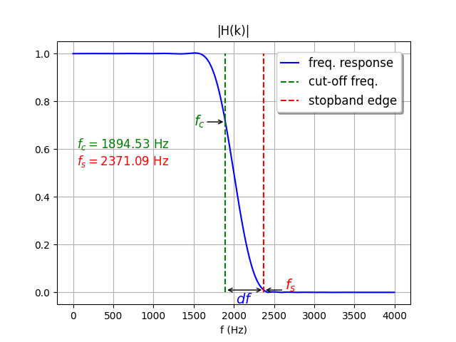

# DSP Notes


## Discrete LTI Systems

A general difference equation represents the response of an LTI system to excitation:

```math
y(n) = \sum_{k=0}^{M} b_k.x(n-k) - \sum_{k=1}^{N}a_k.y(n-k)
```

If all terms with coefficients $`a_k`$ are zero, the system will be FIR, otherwise it’s called IIR. Therefore, FIR is a Feed-Forward system and it has zeros. All its poles lie on zero. Whereas, IIR filter has both poles and zeros.

### FIR Filters

#### Low-Pass FIR

A first degree FIR LPF can be designed as:
```math
\begin{array}{ll}
  &H(e^{-j \omega}) &=
  	\begin{cases}
  		1, & \omega = 0 \\
  		0, &\omega = \pi
  	\end{cases} \\
  & &= cos(0.5 \omega) e^{-j 0.5 \omega} \\
  & &= 0.5(1 + e^{-j \omega}) \\
  & H(z) &= 0.5(1 + z^{-1}) \\
\end{array}
```


For 2nd degree FIR:
```math
\begin{array}{ll}
  & H(z) &= 0.5(1 + z^{-1}) \; \times \; 0.5(1 + z^{-1}) \\
  & &= 0.25(1 + 2z^{-1} + z^{-2})
\end{array}
```


#### High-Pass FIR

A first degree FIR HPF can be designed as:
```math
\begin{array}{ll}
  &H(e^{-j \omega}) &=
  	\begin{cases}
  		1, & \omega = \pi \\
  		0, &\omega = 0
  	\end{cases} \\
  & &= j \; sin(0.5 \omega) \; e^{-j 0.5 \omega} \\
  & &= 0.5(1 - e^{-j \omega}) \\
  & H(z) &= 0.5(1 - z^{-1}) \\
\end{array}
```
Therefor, it can be concluded that
```math
H_{HP}(z) = H_{LP}(-z)
```


#### Band-Pass FIR

A first degree FIR BPF can be designed as:
```math
\begin{array}{ll}
  &H(e^{-j \omega}) &=
  	\begin{cases}
  		1, & \omega = \frac{\pi}{2} \\
  		0, &\omega = 0, \pi
  	\end{cases} \\
  & &= j \; sin(\omega) \; e^{-j \omega} \\
  & &= 0.5(1 + e^{-j \omega})(1 - e^{-j \omega}) \\
  & H(z) &= 0.5(1 + z^{-1})(1 - z^{-1}) \\
  & &= 0.5(1 - z^{-2})
\end{array}
```


#### Band-Stop FIR

A first degree FIR BSF can be designed by replacing $`cos`$ with $`sin`$ in BPF as:
```math
\begin{array}{ll}
  &H(e^{-j \omega}) &=
  	\begin{cases}
  		1, & \omega = 0, \pi \\
  		0, &\omega = \frac{\pi}{2}
  	\end{cases} \\
  & &= j \; sin(\omega) \; e^{-j \omega} \\
  & &= 0.5(1 + e^{-j \omega})(1 - e^{-j \omega}) \\
  & H(z) &= 0.5(1 + z^{-1})(1 - z^{-1}) \\
  & &= 0.5(1 - z^{-2})
\end{array}
```


#### All-Pass FIR


```math
H(z) &= z^{-N} \\
H(e^{j \omega}) &= 1, \forall \; \omega
```

#### Example

Assume a signal:
```math
x(n) = cos(0.1n) + cos(0.4n)
```
Let's design a high-pass FIR filter of length 3 that stops the first component $`cos(0.1n)`$. The requirements are:
```math
\begin{array}{l}
  H(e^{j0.1}) = 0 \\
  H(e^{j0.4}) = 1 \\
\end{array}
```
Taking $`\; h(n) = \{\alpha, \beta, \alpha\}`$ 
```math
\begin{array}{lll}
\Rightarrow & H(ej) &= \alpha + \beta e^{-j \omega} + \alpha e^{-j2 \omega} \\
						&  			&= e^{-j \omega}(\alpha e^{j \omega} +  \beta + \alpha e^{-j \omega}) \\
						&  			&= e^{-j \omega}(\beta + 2 \alpha cos(\omega))
\end{array}
```
From the magnitude component:
```math
\begin{array}{ll}
	\Rightarrow & \beta + 2 \alpha . cos(0.1) = 0 \\
	&\beta + 2 \alpha . cos(0.4) = 1
\end{array}
```
Solving the system of equations
```math
\begin{array}{lr}
	 \alpha = -6.76195 \\
	 \beta  = 17.456335
\end{array}
```
Hence, the difference equation for the filter will be:
```math
\begin{align}
& y(n) = \alpha x(n) + \beta x(n-1) + \alpha x(n-2) \\
& Y(z) = \alpha z + \beta z^{-1} + \alpha z^{-2}
\end{align}
```

### IIR Filters

#### Low-Pass IIR

- Numerator is same as FIR i.e. zeros at $`\pi`$.

- In addition, it has poles in right-half near near unit circle.
    ```math
    H(z) &= \frac{1 - \alpha}{2} \; \frac{1 + z^{-1}}{1 - \alpha z^{-1}} \\
    H(e^{j \omega}) &= \frac{1 - \alpha}{2} \; \frac{1 + e^{-j \omega}}{1 - \alpha e^{-j \omega}}
    ```

Taking $`\alpha = 0.9`$:


#### High-Pass IIR

In addition to the fractional form of the FIR filter, it has zeros in the left-half near unit circle:
```math
H(z) &= \frac{1 - \alpha}{2} \; \frac{1 - z^{-1}}{1 + \alpha z^{-1}} \\
H(e^{j \omega}) &= \frac{1 - \alpha}{2} \; \frac{1 - e^{-j \omega}}{1 + \alpha e^{-j \omega}}
```
Taking $`\alpha = -0.9`$:


#### Band-Pass IIR


```math
H(z) &= \frac{1 - \alpha}{2} \; \frac{1 - z^{-2}}{1 - \beta (1 + \alpha) z^{-1} + \alpha^2 z^{-2}} \\
H(e^{j \omega}) &= \frac{1 - \alpha}{2} \; \frac{1 - e^{-j 2 \omega}}{1 - \beta (1 + \alpha) e^{-j \omega} + \alpha^2 e^{-j 2 \omega}} \\
```
Therefore, zeros and poles are:
```math
\begin{aligned}
\text{zeros:} \; z &= \Bigl\{ -1,\; 1 \Bigr\} \\
\text{poles:} \; z &= \Bigl\{ \frac{-\sqrt{(-\alpha \beta - \beta)^2 - 4 \alpha^2} + \alpha \beta + \beta}{2},\; \frac{\sqrt{(-\alpha \beta - \beta)^2 - 4 \alpha^2} + \alpha \beta + \beta}{2} \Bigr\}
\end{aligned}
```
For $`\alpha = 0.9`$ and $`\beta = 0.6`$, poles are at $`z = 0.57 \pm 0.69649j`$ :


#### Band-Stop IIR


```math
H(z) &= \frac{1 + \alpha}{2} \; \frac{1 - 2 \beta z^{-1} + z^{-2}}{1 - \beta (1 + \alpha) z^{-1} + \alpha^2 z^{-2}} \\
H(e^{j \omega}) &= \frac{1 + \alpha}{2} \; \frac{1 - 2 \beta e^{-j \omega} + e^{-j 2 \omega}}{1 - \beta (1 + \alpha) e^{-j \omega} + \alpha^2 e^{-j 2 \omega}} \\
zeros: & \Bigl\{ \beta - \sqrt{\beta^2 - 1},\; β + \sqrt{\beta^2 - 1} \Bigr\} \\
```
Therefore, zeros and poles are:
```math
\begin{aligned}
\text{zeros:} \; z &= \Bigl\{ \beta - \sqrt{\beta^2 - 1},\; β + \sqrt{\beta^2 - 1} \Bigr\} \\
\text{poles:} \; z &= \Bigl\{ \frac{-\sqrt{(-\alpha \beta - \beta)^2 - 4 \alpha^2} + \alpha \beta + \beta}{2},\; \frac{\sqrt{(-\alpha \beta - \beta)^2 - 4 \alpha^2} + \alpha \beta + \beta}{2} \Bigr\}
\end{aligned}
```


For $`\alpha = 0.9`$ and $`\beta = 0.6`$, zeros are at $`z = 0.6 \pm 0.8j`$ and poles are at $`z = 0.57 \pm 0.69649j`$ :


## Filter Design

Following are the points to consider while choosing between an FIR and IIR filter.

1. **Linear phase**: Linear phase (FIR) response has same delay at all frequencies. Non-linear phase (IIR) has serious effect on signalling pulses, and least effect on intelligibility.
2. **Efficiency**: IIR can have a sharper transition region than an FIR. An IIR filter can be desined with fewer delay elements and multipliers. An FIR filter can be designed with FFT based fast convolution. As a result:
    1. FIR filters, due to long processing time, are used for non-real-time applications
    2. IIR filters are usually used in fast or real-time applications
3. **Stability**: An FIR filter is always stable. An IIR filter can become unstable under special conditions (e.g arithmatic overflow caused by the input).
4. **Conversion from Analog Filters**: Conventional analog filters in $`s`$ domain are expressed as rational functions with poles. Their digital counterparts result in an IIR filter. The examples being Butterworth, Chebychev, Eliptic, etc.

### Pole-Zero Estimation

The most critical part of the design is determinig the location of poles and zeros of the transfer function. Several design methods exist and the coice of one depends on the specifications.

We use optimized Park-McLellan algorithm for the FIR filter design having equiripple response and minimum number of zeros. The best method to design an IIR filter is the bilinear z-transform (BZT) to convert the analog ($`s`$-domain) transfer function into a $`z`$-domain function.

### Implementation Structures

- For a filter to be implemented on general-purpose computer with floating-point hardware, the coice of poles/zeros (or filter coefficients) completes the design.
- However, most digital filters are implemented on a DSP processor or a special purpose microcontrollers using interger arithmatic with approximately a few bits of precision. The quantization of coefficients, round-off calculation errors, and filter structures can have a significant effect on the efficiency of the filter.
- The quantization changes the effetive values of the coefficients and therefore must be re-evaluated with the quantized and scaled coefficients.

### Filter Requirements

- Specifications are often considered in frequency domain and in form of a tolerance scheme.
- Amplitude response in passband has a peak deviation $`\delta_p`$, and stopband peak deviation is $`\delta_s`$.
- The width of transition region determines sharpness.
- The amplitude response transitions uniformly from passband to stopband.
- The key parameters for an FIR (in terms of a low-pass filter) are:
    - passband deviation: $`\delta_p`$
    - stopband deviation: $`\delta_s`$
    - passband amplitude: $`1-\delta_p \le |H(n)| \le 1+\delta_p`$
    - passband edge frequency: $`\omega_p`$ at $`|H(n)| = 1-\delta_p`$
    - cut-off frequency: $`\omega_c`$ at $`|H(n)| = \frac{1}{\sqrt{2}}`$
    - stopband edge frequency: $`\omega_s`$ at $`|H(n)| \le \delta_s`$
    - passband: $`[0, \omega_p]`$
    - transition band: $`\omega_s - \omega_p`$
    - stopband: $`[\omega_s, \pi]`$
- The key parameter differences for an IIR (in terms of a low-pass filter) are:
    - passband amplitude: $`\frac{1}{\sqrt{1+\epsilon^2}} \le |H(n)| \le 1`$
    - passband edge frequency: $`\omega_p`$ at $`|H(n)| = \frac{1}{\sqrt{1+\epsilon^2}}`$
    - stopband amplitude: $`|H(n)| \le \frac{1}{A}`$


### FIR Filter Design

#### Phase and Group Delay

- Phase delay ($`T_p = \frac{-\theta(\omega)}{\omega}`$) is useful for analyzing broadband signals (covering frequency range $`[-\pi, \pi]`$)

- Group delay ($`T_g = \frac{-d \theta(\omega)}{d \omega}`$) is widely used in the investigation of the systems with narrowband input signals.

- For example, let $`x(n) = s(n)\;e^{j \omega_0 n}`$ where $`s(n)`$ is a signal with very slow time variation. The system output will be: $`y(n) \approx |H(e^{j \omega_0})| \; s[n - T_g(\omega_0)] \; e^{j \omega_0 [n-T_p(\omega_0)]}`$

- Here the $`T_p(\omega_0)`$ imposes phase shift on the carrier $`e^{j \omega_0}`$, while $`T_g(\omega_0)`$ imposes delay to the envelop of the signal $`s(n)`$.

- In a non-linear phase systems, each frequency component in the signal is delayed by an amount disproportionate to the frequency.

- It's undesirable in applications like music, data transmission, video, and biomedical science. Hence, linear phase filters are used for such signals.

- A filter has a linear phase response if one of the following relationships are satisfied:
    ```math
    \begin{array}{l}
      \theta(\omega) = -\alpha\omega \\
      \theta(\omega) = \beta-\alpha\omega \\
    \end{array}
    ```
    where $`\alpha`$ and $`\beta`$ are fixed values. If first condition is met, the filter has both constant group and phase delay.

- In order to satisfy this condition, the impulse response must have positive symmetry.
    ```math
    \begin{array}{l}
      h(n) = h(N-n-1) \\
      \begin{cases}
      	n = 0,1,...,(N-1)/2 &, odd \; N \\
      	n = 0,1,...,(N/2-1) &, even \; N
      \end{cases} \\
      \alpha = (N-1)/2
    \end{array}
    ```
    
- If only the second equation is satisfied, the filter will have only one fix group delay and the impulse response of the filter will have negative symmetry:
    ```math
    \begin{array}{rl}
      h(n) &= -h(N-n-1) \\
      \alpha &= (N-1)/2 \\
      \beta &= \pi/2
    \end{array}
    ```


#### Types of Symmetry

In the following discussion, the filter degree $`N`$ is defined by the maximum delay $`M`$ in the impulse response as: $`N = M+1`$

- Type 1 Symmetry: even $`M`$, even symmetry
- Type 2 Symmetry: odd $`M`$, even symmetry
- Type 3 Symmetry: even $`M`$, odd symmetry
- Type 4 Symmetry: odd $`M`$, odd symmetry

#### Type 1 Symmetry

In this case, the filter degree is odd. Let's take an example with $`M=4`$ resulting in $`N = 5`$.
```math
h_1(n) = b_0 \delta(n) + b_1 \delta(n-1) + b_2 \delta(n-2) + b_1 \delta(n-3) + b_0 \delta(n-4)
```
The frequency response simplifies to following:
```math
\begin{array}{rl}
  H_1(e^{j \omega}) &= b_0 + b_1 e^{-j \omega} + b_2 e^{-j 2 \omega} + b_1 e^{-j 3 \omega} + b_0 e^{-j 4 \omega} \\
  & = e^{-j 2 \omega}[(b_0 e^{j 2 \omega} + b_0 e^{-j 2 \omega}) + (b_1 e^{j \omega} + b_1 e^{-j \omega}) + b_2] \\
  & = e^{-j 2 \omega}[2 b_0 cos(2 \omega) + 2 b_1 cos(\omega) + b_2] \\
  & = e^{-j 2 \omega} \; |H_1(e^{j \omega})|
\end{array}
```
The above expression shows that the pahse of the response ($`e^{-j 2 \omega}`$) is linear. Therefore, in general case:
```math
h_1(n) = b_{M/2} + \sum_{k=0}^{M/2} b_k [\delta(n-k) + \delta(n-M+k)]
```
and the frequency response is of the form:
```math
&H_1(e^{j \omega}) & = & e^{-j \frac{M}{2} \omega} \; \Bigl\{ b_{M/2} + \sum_{k=0}^{M/2-1} 2 b_k\;cos\Bigl[ \Bigl( \frac{M}{2}-k \Bigr) \omega \Bigr] \Bigr\} \\
& & \equiv & e^{-j \frac{M}{2} \omega} \; \Bigl\{ h(M/2) + 2 \sum_{k=1}^{M/2} h\Bigl(\frac{M}{2}-k\Bigr)\;cos(k \omega) \Bigr\}
```

#### Type 2 Symmetry

In this case, the filter degree is odd. Let's take an example with $`M=5`$ resulting in $`N = 6`$.
```math
h_1(n) = b_0 \delta(n) + b_1 \delta(n-1) + b_2 \delta(n-2) + b_2 \delta(n-3) + b_1 \delta(n-4) + b_0 \delta(n-5)
```
The frequency response simplifies to following:
```math
\begin{array}{rl}
  H_2(e^{j \omega}) &= b_0 + b_1 e^{-j \omega} + b_2 e^{-j 2 \omega} + b_2 e^{-j 3 \omega} + b_1 e^{-j 4 \omega} + b_0 e^{-j 5 \omega} \\
  & = 2 e^{-j 2.5 \omega} \Bigl[b_0 cos(2.5 \omega) + b_1 cos(1.5 \omega) + b_2 cos(0.5 \omega) \Bigr] \\
  & = e^{-j 2.5 \omega} \; \big\vert H_2(e^{j \omega}) \big\vert
\end{array}
```
The above expression shows that the pahse of the response ($`e^{-j 2.5 \omega}`$) is linear. Therefore, in general case:
```math
h_2(n) = \sum_{k=0}^{\frac{M-1}{2}} b_k [\delta(n-k) + \delta(n-M+k)]
```
The frequency response will be:
```math
\begin{align}
  &H_2(e^{j \omega}) & = \; & e^{-j \frac{M}{2} \omega} \; \Bigl\{ 2 \sum_{k=0}^{\frac{M-1}{2}} b_k\;cos\Bigl[ \Bigl( \frac{M}{2}-k \Bigr) \omega \Bigr] \Bigr\} \\
  & & \equiv \; & e^{-j \frac{M}{2} \omega} \; \Bigl\{ 2 \sum_{k=1}^{\frac{M+1}{2}} h\Bigl( \frac{M+1}{2} - k \Bigr)\;cos[(k -0.5) \omega] \Bigr\}
\end{align}
```
Note that $`H_2(e^{j \pi}) = 0`$ for type 2 filter.


#### Type 3 Symmetry

In this case, the filter degree is odd. Let's take an example with $`M=6`$ resulting in $`N = 7`$. The impulse response will be:
```math
h_3(n) = b_0 \delta(n) + b_1 \delta(n-1) + b_2 \delta(n-2) + 0 + b_2 \delta(n-4) + b_1 \delta(n-5) + + b_0 \delta(n-6)
```
this simplifies to:
```math
\begin{array}{rl}
  H_3(e^{j \omega}) &= b_0 + b_1 e^{-j \omega} + b_2 e^{-j 2 \omega} + b_2 e^{-j 4 \omega} + b_1 e^{-j 5 \omega} + b_0 e^{-j 6 \omega} \\
  & = e^{-j 3 \omega}[(b_0 e^{j 3 \omega} - b_0 e^{-j 3 \omega}) + (b_1 e^{j 2 \omega} - b_1 e^{-j 2 \omega}) + (b_2 e^{j \omega} - b_2 e^{-j \omega})] \\
  & = e^{-j 3 \omega}\;(2j)\;\bigl[b_0 sin(3 \omega) + b_1 sin(2 \omega) + b_2 sin(\omega) \bigr] \\
  & = e^{-j(\frac{\pi}{2} - 3 \omega)}\;\Bigl\{(2)\bigl[b_0 sin(3 \omega) + b_1 sin(2 \omega) + b_2 sin(\omega) \bigr]\Bigr\} \\
  & = e^{-j(\frac{\pi}{2} - 3 \omega)} \; \big\vert H_3(e^{j \omega}) \big\vert
\end{array}
```
and generalized as:
```math
h_3(n) = \sum_{k=0}^{\frac{M}{2} - 1} b_k [\delta(n-k) - \delta(n-M+k)]
```
the frequency response simplifies as:
```math
\begin{align}
  &H_3(e^{j \omega}) & = \; & e^{j (\frac{\pi}{2} - \frac{M}{2} \omega)} \; \Bigl\{ 2 \sum_{k=0}^{\frac{M}{2}-1} b_k\;sin\Bigl[ \Bigl( \frac{M}{2}-k \Bigr) \omega \Bigr] \Bigr\} \\
  & & \equiv \; & e^{-j (\frac{M\omega - \pi}{2})} \; \Bigl\{ 2 \sum_{k=1}^{\frac{M}{2}} h\Bigl( \frac{M}{2} - k \Bigr)\;sin(k \omega) \Bigr\}
\end{align}
```
For third type FIR: $`H_3(e^{j0}) = H_3(e^{j \pi}) = 0`$.

#### Type 4 Symmetry

In this case, the filter degree is odd. Let's take an example with $`M=5`$ resulting in $`N = 6`$. The impulse response will be:
```math
h_4(n) = b_0 \delta(n) + b_1 \delta(n-1) + b_2 \delta(n-2) + b_2 \delta(n-3) + b_1 \delta(n-4) + + b_0 \delta(n-5)
```
this simplifies to:


```math
\begin{array}{rl}
  H_4(e^{j \omega}) &= b_0 + b_1 e^{-j \omega} + b_2 e^{-j 2 \omega} + b_2 e^{-j 3 \omega} + b_1 e^{-j 4 \omega} + b_0 e^{-j 5 \omega} \\
  & = e^{-j 2.5 \omega}[(b_0 e^{j 2.5 \omega} - b_0 e^{-j 2.5 \omega}) + (b_1 e^{j 1.5 \omega} - b_1 e^{-j 1.5 \omega}) + (b_2 e^{j 0.5 \omega} - b_2 e^{-j 0.5 \omega})] \\
  & = e^{-j 3 \omega}\;(2j)\;\bigl[b_0 sin(2.5 \omega) + b_1 sin(1.5 \omega) + b_2 sin(0.5 \omega) \bigr] \\
  & = e^{j(\frac{\pi}{2} - 2.5 \omega)}\;\Bigl\{(2)\bigl[b_0 sin(2.5 \omega) + b_1 sin(1.5 \omega) + b_2 sin(0.5 \omega) \bigr]\Bigr\} \\
  & = e^{j(\frac{\pi}{2} - 2.5 \omega)} \; \big\vert H_4(e^{j \omega}) \big\vert
\end{array}
```
and generalized as:
```math
h_4(n) = \sum_{k=0}^{\frac{M-1}{2}} b_k [\delta(n-k) - \delta(n-M+k)]
```
the frequency response simplifies as:
```math
\begin{align}
  &H_3(e^{j \omega}) & = \; & e^{j (\frac{\pi}{2} - \frac{M}{2} \omega)} \; \Bigl\{ 2 \sum_{k=0}^{\frac{M-1}{2}} b_k\;sin\Bigl[ \Bigl( \frac{M}{2}-k \Bigr) \omega \Bigr] \Bigr\} \\
  & & \equiv \; & e^{-j (\frac{M\omega - \pi}{2})} \; \Bigl\{ 2 \sum_{k=1}^{\frac{M+1}{2}} h\Bigl( \frac{M+1}{2} - k \Bigr)\;sin[(k - 0.5) \omega] \Bigr\}
\end{align}
```
For third type FIR: $`H_3(e^{j0}) = 0`$.

#### Types of Symmetry and Applications

| Type | Resp.                               | LPF  | HPF  | Hilbert | Derivative |
| ---- | ----------------------------------- | ---- | ---- | ------- | ---------- |
| 1    |                                     | ✔    | ✔    | x       | x          |
| 2    | $`H_2(e^{j \pi}) = 0`$                | ✔    | x    | x       | x          |
| 3    | $`H_2(e^{j 0}) = H_2(e^{j \pi}) = 0`$ | x    | x    | ✔       | ✔          |
| 4    | $`H_2(e^{j 0}) = 0`$                  | x    | x    | ✔       | ✔          |


#### Time-Window Design

- IFFT of the desired frequency response gives us the idela filter response.

- However, zero response in stopband or a sharp transition maps to infinite response (e.g. sinc function).

- As a result, we have to truncate the response samples, which is effectively multiplying the frequency response by a window function of length $`N`$.

- The effect of time-domain multiplication is the convolution of the frequency response with the Fourier transform of the window function.
    ```math
    \begin{aligned}
    h_p(n) &= h_d(n).w(n) \\
    H_p(\omega) &= \frac{1}{2 \pi} \; \int_{-\pi}^{\pi} H_d(e^{j \theta}) W(e^{j (\omega - \theta)}) \; d \theta
    \end{aligned}
    ```

- Window function is a compromise between the width of the main lobe and the levels of the sidelobes.

- The effect of this operation is the leakage from the stopband into the passband.

- The effect of the truncation can cause oscillatory behavior, called Gibbs phenomenon, in the filter's frequency response.





#### Design Steps

- Choose a window function that produces the desired attenuation in the stopband as well as the passband ripple.
- Calculate the approximate number of coefficients $`N`$ from the width of the desired transition region.
- Compute $`N`$ sample values of the window function.
- Find the impulse response of the of the ideal filter with cutoff frequecy centered in the transition region.
- Multiply the window and impulse response of the filter to get the filter coefficients.
- Calculate the frequency response of the filter to cross-check with the desired specifications.

#### Example Windowed LPF

- passband edge frequency: $`f_p = 2 \; kHz`$
- transition region: $`\Delta f = 800 \; Hz`$
- stopband attenuation: $`A_s > 40 \; dB`$
- sampling frequency: $`F_s = 8 \; kHz`$

```math
h_D(n) =
\begin{cases}
	2f_{c_n} \frac{sin(n \omega_{c_n})}{n \omega_{c_n}} &, n \ne 0 \\
	2f_{c_n} &, n = 0
\end{cases}
```

- Transition region relative to sampling frequency: $`\Delta f_n = \frac{\Delta f}{F_s} = \frac{800}{8000} = 0.1`$

- Selecting Hanning window on the basis of stopband attenuation and minimum filter order:
    ```math
    \frac{3.1}{N} = \Delta f_n = 0.1 \Rightarrow N = \frac{3.1}{0.1} = 31
    ```

- 

- The order of the filter is $`N = 31`$, the coefficients are obtained as:
    ```math
    \begin{aligned}
    h(n) &= h_D(n)w(n) &, -15 \le n \le 15 \\
    w(n) &= 0.5 + 0.5\;cos\bigl(2 \pi n / 31 \bigr) &, -15 \le n \le 15
    \end{aligned}
    ```

- The shift in cutoff frequency, due to the window's smearing effect, must be compensated by moving it to the middle of the transition region:
    ```math
    f_{c_n} = \frac{f_p + \frac{\Delta f}{2}}{F_s} = \frac{(2+0.4)\;kHz}{8\;kHz} = 0.3
    ```

- Considering that $`h(n)`$ is symmetric, we only need values for $`h(0),h(1),...,h(15)`$
    ```math
    \begin{array}{rlll}
    	n = 0: & h_D(0) &= 2f_{c_n} &= 2 \times 0.3 = 0.6 \\
    				 & w(0) &= 0.5+0.5cos(0) &= 1 \\
    				 & h(0) &= h_D(0)w(0) &= 0.6 \\
      n = 1: & h_D(1) &= 2 \times 0.3\frac{sin \bigl( 2\pi \times 0.3 \bigr)}{2\pi \times 0.3} &= 0.3027 \\
      			 & w(1) &= 0.5+0.5cos(2 \pi / 31) &= 0.9898 \\
    				 & h(1) &= h(-1) = h_D(1)w(1) &= 0.2996 \\
      n = 2: & h_D(2) &= 2 \times 0.3\frac{sin \bigl( 2 \times 2\pi \times 0.3 \bigr)}{2 \times 2\pi \times 0.3} &= -0.0935 \\
      			 & w(2) &= 0.5+0.5cos(2 \pi \times 2/ 31) &= 0.9595 \\
    				 & h(2) &= h(-2) = h_D(2)w(2) &= -0.0898 \\
    	\vdots & & & \\
      n = 15: & h_D(15) &= 2 \times 0.3\frac{sin \bigl( 15 \times 2\pi \times 0.3 \bigr)}{15 \times 2\pi \times 0.3} &\approx 0 \\
      			 & w(15) &= 0.5+0.5cos(2 \pi \times 15/ 31) &= 0.0026 \\
    				 & h(15) &= h(-15) = h_D(15)w(15) &\approx 0 \\
    \end{array}
    ```
    




## References

1. John G. Proakis, *Digital Signal Processing*
2. [GitHub Docs, Writing Mathematical Expressions](https://docs.github.com/en/get-started/writing-on-github/working-with-advanced-formatting/writing-mathematical-expressions)

